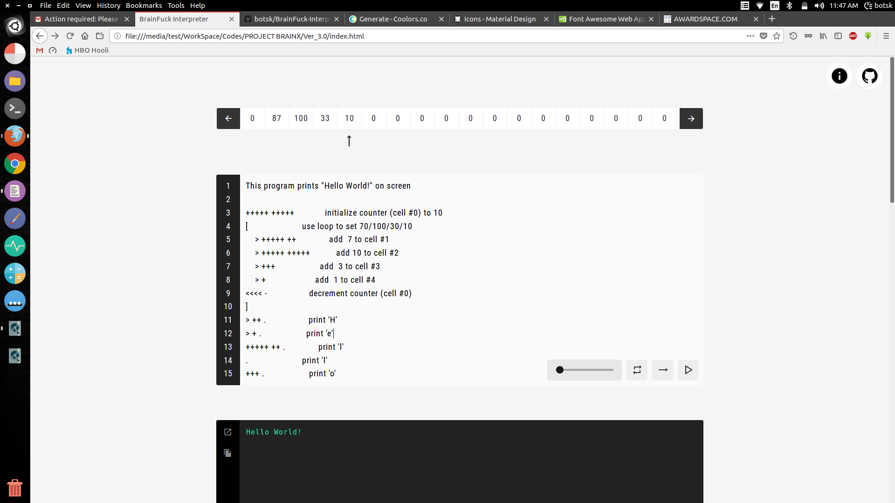
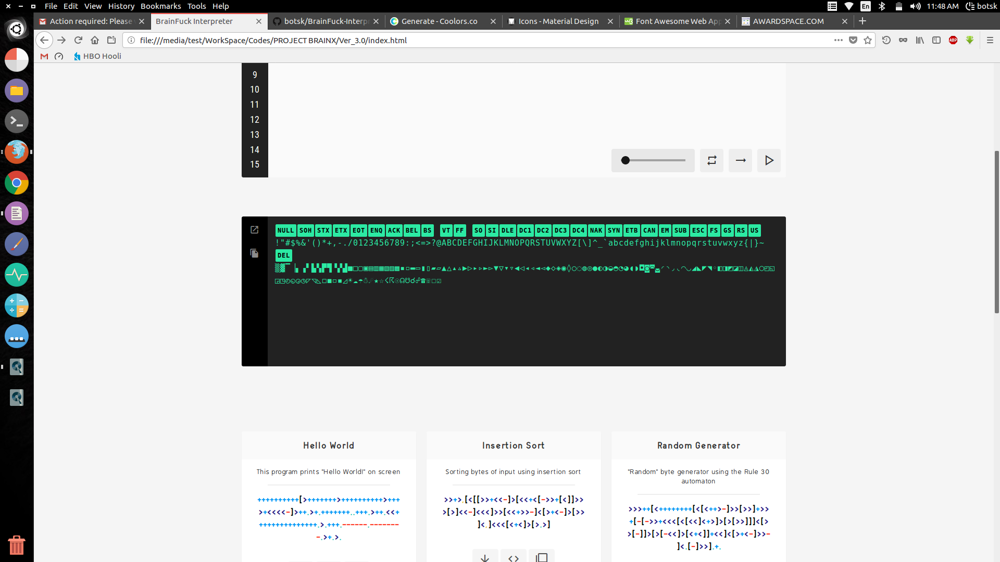
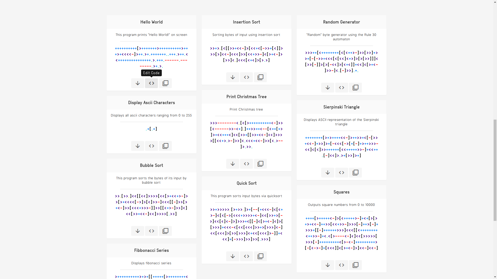

# BrainFuck-Visualizer

An Online Interpreter of esoteric programming language BrainFuck.  
### [https://brainfuck-visualizer.xyz/](https://brainfuck-visualizer.xyz/)


## About BrainFuck

Brainfuck is an esoteric programming language created in 1993 by Urban Müller, and notable for its extreme minimalism.

The language consists of only eight simple commands and an instruction pointer. While it is fully Turing complete, it is not intended for practical use, but to challenge and amuse programmers. Brainfuck simply requires one to break commands into microscopic steps.

The language's name is a reference to the slang term brainfuck, which refers to things so complicated or unusual that they exceed the limits of one's understanding.


### Symbols

#### ``` + ```  Increment current cell with 1 bit
#### ```- ```  Decrement current cell with 1 bit
#### ```> ```  Moves current pointer towards right
#### ```< ```  Moves current pointer towards left
#### ```, ```  Reads Input to the current cell
#### ```. ```  Outputs Ascii char equvivalent for current cell value
#### ```[ ```  Moves pointer forward to the next command if current cell is not zero else jumps to the command after the matching ].
#### ```[ ```  Moves pointer backward to the matching [ if current cell is not zero else jumps to the next command.


## Interpreter

An Interpreter for BrainFuck is developed using web development tools ```HTML``` + ```CSS``` + ```JS``` .

#### ``` Contains 3000 Cells ```


#### ``` Console supporting all ascii characters ```


#### ``` Sample codes provided ```


